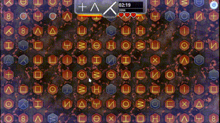

# HEATCHAIN

Quickly find the next glyph, take the bonuses without wasting time and make the longest chain!

## Interface

* You have a glyph in the center that must be found on the board.
* The next two glyph are present for information on the left.
* On the right you have the remaining time and your actual score.
* Below the ui, there is 2 bar who fade, indicating remaining time before the bonus multiplier vanish.
* 3 hearts represent your lives before losing.

## Rule descriptions

* Be quick, your multiplier increases faster by quickly finding the next glyph. (maximum multiplier "15.0")
* Each correct glyph earns 10 points depending on your multiplier.
* If you successfully chain 20 glyphs, you trigger rush mode.
* A bonus does not modify the remaining time to find the glyph, do not waste time finding them !
* Keep your multiplier bar active, by clicking the glyph shown on the interface ! If it disappears, the multiplier drops by 0.5.
* If you click on an incorrect glyph, the chain break. Also, your multiplier drops to 1, and you lose one life.
* You have 3 minutes to make the highest score

## Bonus descriptions

*   : Earn 5/10/20 points depending on your multiplier
* : Recover one life. If you are full life, you gain 
* : Freeze time for 3 seconds
* : Increase the maximum remaining time by 10 seconds
* : Immediately triggers a RUSH

## RUSH Description

In this mode, the board no longer moves. You have few seconds to click as many glyphs as possible.
Your multiplier is set to the maximum possible : 20.0
At the end of the rush mode, the time to find the next glyph is reset.

