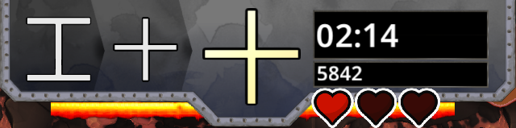
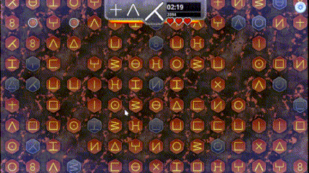

# HEATCHAIN

次のグリフを素早く見つけて、時間を無駄にすることなくボーナスを獲得し、最長のチェーンを作りましょう!

## インターフェースの説明

* 中央にあるグリフは、ボード上で見つける必要があります。
* 次の 2 つのグリフは、左側の情報として表示されます。
* 右側には残り時間と実際のスコアが表示されます。
* UI の下には、ボーナス乗数が消えるまでの残り時間を示す 2 本のバーが消えます。
* 3つのハートは負ける前のライフを表します。

## ルールの説明

* 急いでください。次のグリフをすばやく見つけると、乗数がより速く増加します。 (最大倍率「15.0」)
* 正しい各グリフは、乗数に応じて 10 ポイントを獲得します。
* 20 個のグリフをチェーンすることに成功すると、ラッシュ モードがトリガーされます。
* ボーナスによってグリフを見つけるまでの残り時間は変わりません。グリフを見つける時間を無駄にしないでください。
* インターフェイスに表示されているグリフをクリックして、マルチプライヤー バーをアクティブなままにしておきます。 消えると倍率が0.5下がります。
* 間違ったグリフをクリックすると、チェーンが切れます。 また、マルチプライヤーは 1 になり、ライフが 1 つ失われます。
* 最高スコアを達成するまでの時間は 3 分です

## ボーナスの説明

*   : マルチプライヤーに応じて 5/10/20 ポイントを獲得します
* : ライフを1つ回復する。 人生を充実させれば、得られるもの 
* : 3秒間のフリーズタイム
* : 最大残り時間を10秒延長する
* : 即 RUSH 発動

## RUSH 説明

このモードでは、ボードは動きません。 数秒以内にできるだけ多くのグリフをクリックしてください。
乗数は可能な最大値に設定されています: 20.0
ラッシュ モードの終了時に、次のグリフを見つけるまでの時間はリセットされます。

