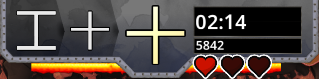

# HEATCHAIN

다음 글리프를 빠르게 찾고, 시간 낭비 없이 보너스를 받고, 가장 긴 체인을 만드세요!

## 인터페이스 설명

* 중앙에 보드에서 찾아야 하는 문양이 있습니다.
* 왼쪽에 정보를 제공하기 위해 다음 두 개의 문자가 표시됩니다.
* 오른쪽에는 남은 시간과 실제 점수가 표시됩니다.
* UI 아래에는 보너스 배수가 사라지기까지 남은 시간을 나타내는 페이드 막대 2개가 있습니다.
* 3개의 하트는 패배 전의 삶을 나타냅니다.

## 규칙 설명

* 빨리, 다음 문자를 빠르게 찾아 승수를 더 빠르게 증가시키세요. (최대 승수 "15.0")
* 각각의 올바른 문양은 승수에 따라 10점을 얻습니다.
* 20개의 글리프를 성공적으로 연결하면 러시 모드가 발동됩니다.
* 보너스는 글리프를 찾는 데 남은 시간을 수정하지 않습니다. 글리프를 찾는 데 시간을 낭비하지 마세요!
* 인터페이스에 표시된 문자를 클릭하여 승수 막대를 활성 상태로 유지하세요! 사라지면 승수는 0.5만큼 떨어집니다.
* 잘못된 문양을 클릭하면 체인이 끊어집니다. 또한 승수는 1로 떨어지고 생명 하나를 잃습니다.
* 최고 점수를 만드는 데 3분이 주어집니다.

## 보너스 설명

*   : 승수에 따라 5/10/20 포인트 적립
* : 생명 하나를 회복합니다. 생명력이 가득 차면 
* : 3초 동안 정지 시간
* : 최대 남은 시간을 10초 늘립니다.
* : 즉시 RUSH를 트리거합니다.

## RUSH 설명

이 모드에서는 보드가 더 이상 움직이지 않습니다. 가능한 한 많은 글리프를 클릭하는 데 몇 초 밖에 걸리지 않습니다.
승수는 가능한 최대값인 20.0으로 설정되어 있습니다.
러시 모드가 끝나면 다음 문양을 찾는 시간이 재설정됩니다.

